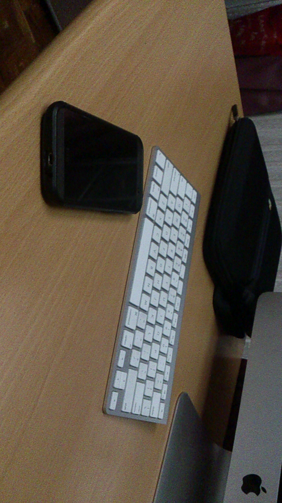
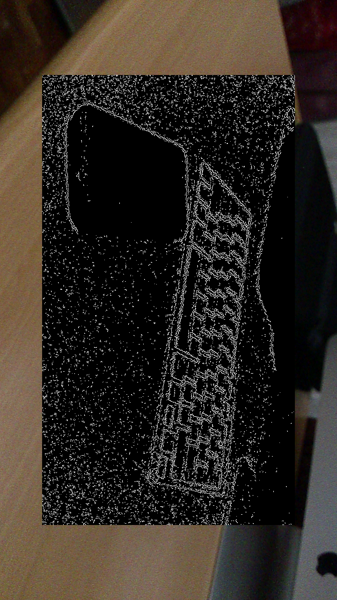
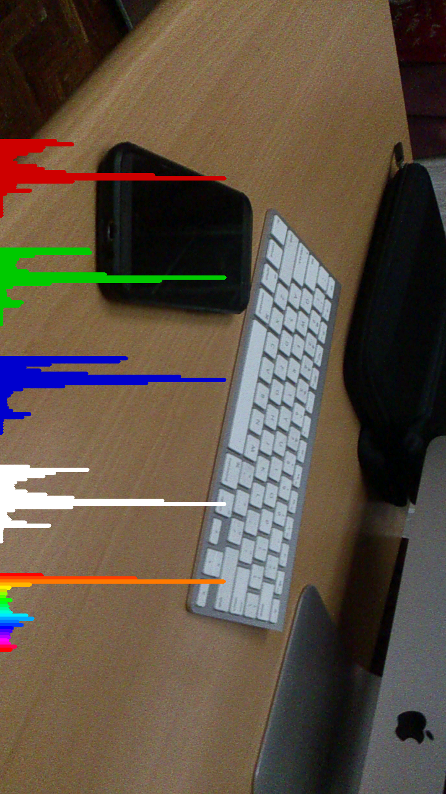
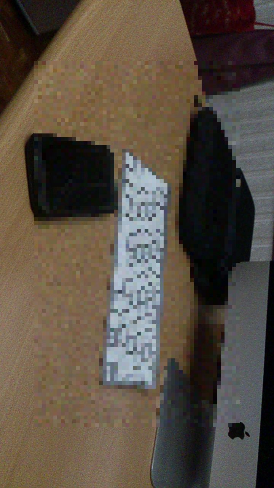
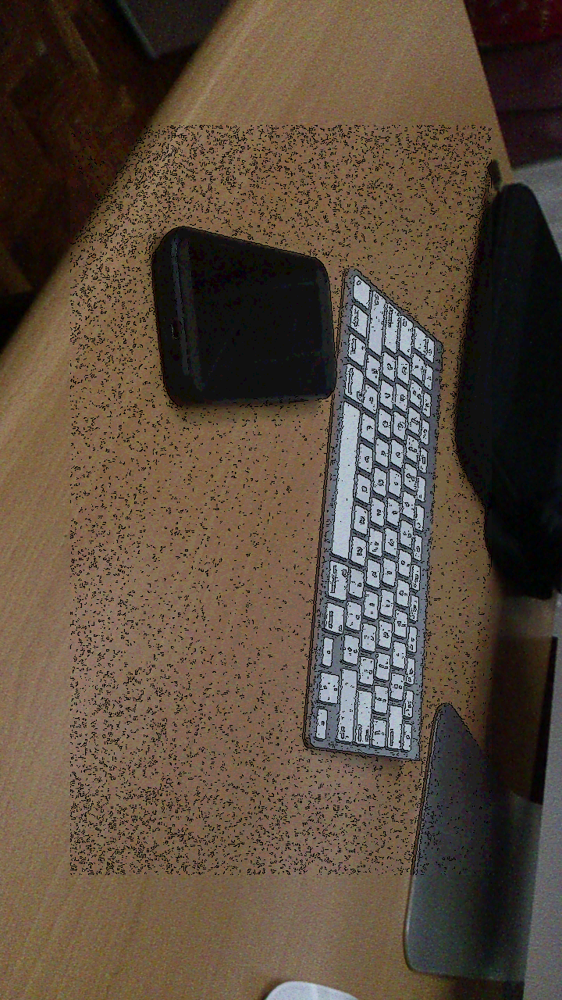
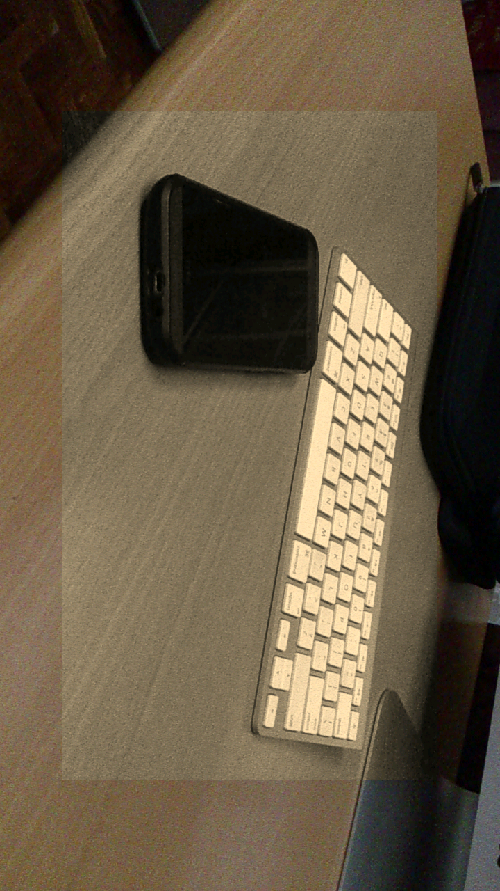
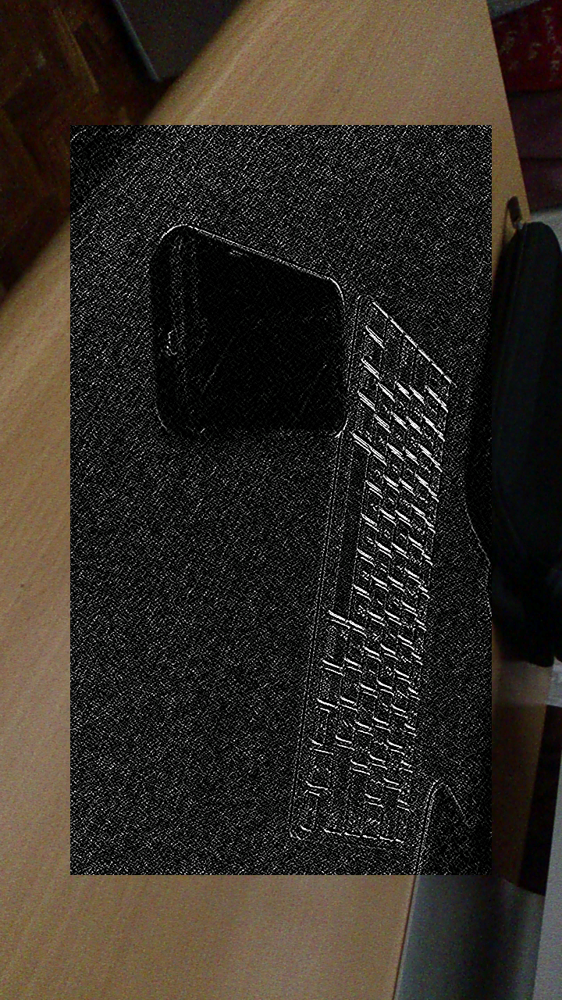
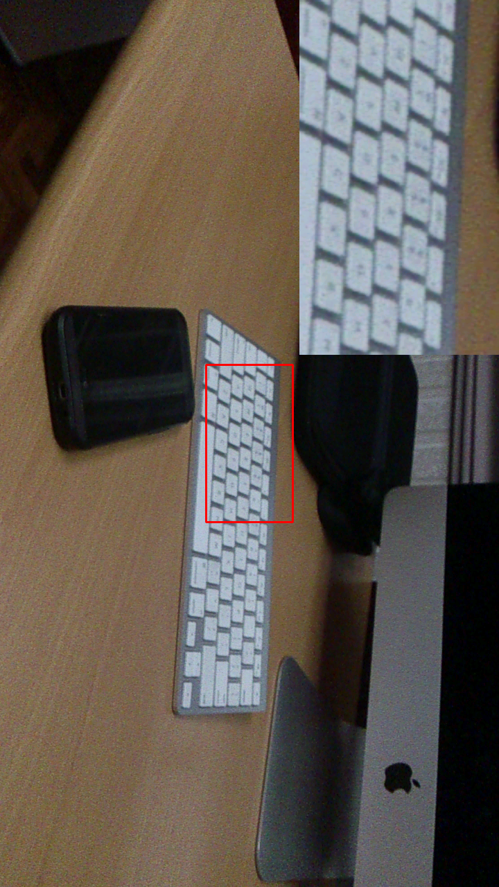

# OpenCV Image Manipulations

opencvimagemanipulations-rohit0000 created by Classroom for GitHub

This project shows the implementation of basic image manipulations from OpenCV for Android Samples in Android Studio.

##Screenshot
RGBA

Canny 

Histogram

Pixelize

Poster

Sepia

Sobel

Zoom

